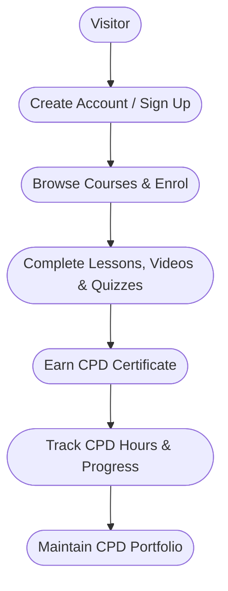

# **Welcome to the CPD365 User Guide**

Welcome to the official documentation for **CPD365**, a modern online learning platform built for **nurses, midwives, NDIS support workers, and other frontline healthcare professionals**.
Inside this guide, you’ll find everything you need to confidently navigate the platform, complete CPD courses, manage your organization, and maintain audit-ready CPD records.

Whether you're here as an individual learner or managing training for an entire healthcare team, this guide will help you get the most out of your CPD365 experience.

---

## **Who This Documentation Is For**

This guide is designed for three primary user groups:

### 👩‍⚕️ **Learners**

Healthcare professionals who want to:

* Complete CPD courses
* Track annual CPD hours
* Earn certificates
* Maintain a personal CPD portfolio

This includes *Registered Nurses, Enrolled Nurses, Midwives, NDIS workers, Aged Care staff,* and *other healthcare clinicians*.

### 🏢 **Organization Admins**

Users responsible for managing teams and training:

* Adding and managing learners
* Assigning courses and programs
* Monitoring compliance
* Generating reports and analytics

### 💳 **Finance & Billing Contacts**

Users who handle:

* Subscription and plan management
* Payments, invoices, and receipts
* Renewals and cancellations

---

## **How This Documentation Is Structured**

To make learning CPD365 simple and intuitive, the documentation is organized into major sections:

### 📘 **Getting Started**

Ideal for new users. Covers:

* What CPD365 is
* Creating and verifying an account
* Logging in
* Taking your first course

### 🎓 **Learner Guide**

Step-by-step instructions for learners:

* Dashboard overview
* Finding and completing courses
* Tracking CPD hours
* Downloading certificates
* Updating your profile

### 🛠️ **Admin Guide**

Designed for organization administrators:

* Setting up an organization
* Adding and managing learners
* Assigning compliance programs
* Running reports & analytics

### 💰 **Billing & Accounts**

Everything related to payments:

* Plans & pricing
* Invoices and receipts
* Renewals
* Cancelling or modifying subscriptions

### 🆘 **Help & Support**

Includes:

* FAQs
* Troubleshooting guides
* Product updates & release notes

Use the **left sidebar** to browse topics, or the **search bar** to quickly find what you need.

---

## **Conventions Used in This Documentation**

Throughout the guide, you’ll see several formatting conventions:

> **Notes**
> Helpful context, reminders, or optional information.

!!! tip
Shortcuts, best practices, and efficiency boosters.

!!! warning
Important cautionary advice about irreversible actions or common mistakes.

You’ll also see icons and labels representing:

* Navigation items
* Buttons on the CPD365 interface
* Desktop vs. mobile interactions

All screenshots and diagrams are designed to match the real CPD365 interface for clarity and familiarity.

---

## **User Journey Overview**

Below is a high-level visual showing the typical path a new user follows inside CPD365.

### **Improved Mermaid Diagram**

This version includes clearer node labels, consistent formatting, and an extended final step for accuracy.

You can embed this directly into your Markdown or documentation system.
Later, it can be replaced with a polished SVG stored in `/assets`.

---

Let me know if you’d like:
🔹 a dark-mode or horizontal version of the diagram
🔹 icons included in the Mermaid nodes
🔹 an expanded journey for admins or billing users
